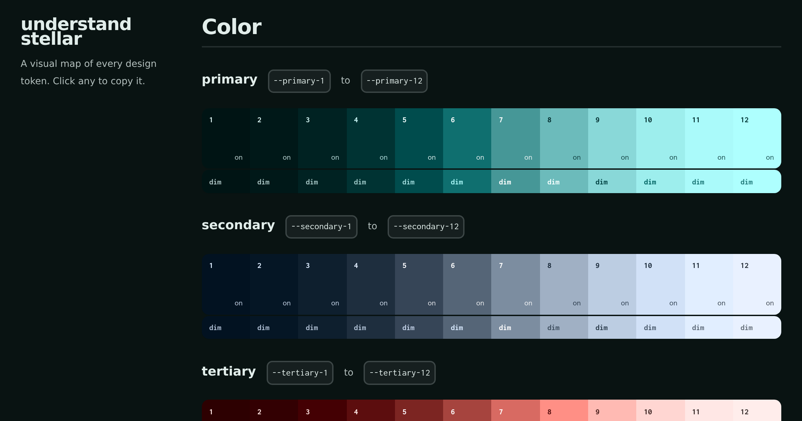

<h1 align="center">understand stellar</h1>

<p align="center">
  <a href="https://cablehead.github.io/understand-stellar/">
    
  </a>
</p>

<p align="center">
  A visual reference for the <a href="https://data-star.dev/pro#stellar-css">Stellar</a> CSS framework:
  every design token, shown visually rather than just named.
  <br /><br />
  <a href="https://cablehead.github.io/understand-stellar/">Live site</a>
  &nbsp;&middot;&nbsp;
  <a href="#what-it-covers">What it covers</a>
  &nbsp;&middot;&nbsp;
  <a href="#run">Run</a>
  &nbsp;&middot;&nbsp;
  <a href="https://data-star.dev/pro">Buy Stellar</a>
</p>

One scrolling page that shows every design variable Stellar generates, grouped
by the decision it serves and demonstrated visually rather than just named.
Click any token to copy its variable name; toggle the theme to check both light
and dark.

Built with [http-nu](https://http-nu.cross.stream): the page is a single Nushell
handler using the embedded HTML DSL and router.

## Stellar is made by Star Federation

Stellar CSS is built by [Star Federation](https://github.com/starfederation),
the team behind [Datastar](https://data-star.dev). It ships as part of
**Datastar Pro**, a one-time, lifetime license that also funds the open-source
Datastar work.

This reference exists because Stellar is worth understanding: a complete,
configurable design system as plain CSS custom properties, no build step,
generated locally from one config. If you build for the web, it is worth buying:
[data-star.dev/pro](https://data-star.dev/pro). One purchase covers every Pro
plugin plus Stellar for the life of the license, and it funds the open-source
project. Thanks to the Star Federation team for building it.

## What it covers

Each family is shown with a visual metaphor, not a list:

- **Color**: six semantic roles as 12-step ramps. The step number on every
  swatch is painted in that step's `-on` color, so foreground legibility is
  visible in place; a band below samples each `-dim` variant. Plus named brand
  ramps, chart palettes (qualitative + diverging), gradients, and a live syntax
  palette rendered through the highlighter.
- **Type**: the fluid size scale set as real specimens, every font family shown
  with the same sentence, weights as a ramp, and line-height / letter-spacing
  demonstrated on real paragraphs.
- **Space**: the size scale as bars whose width is the token value, so the
  geometric rhythm is visible.
- **Borders & radius**: boxes with the radius and width applied directly, plus
  the organic blob and hand-drawn shapes.
- **Elevation**: shadows cast on surfaces; negative steps press inward as wells,
  positive steps lift off the page.
- **Motion**: a **Compose** panel that builds a real transition (property +
  amount + duration + easing) from the tokens, plays it, and hands you the CSS
  to copy, plus the raw amount stops. This is how the tokens are used together.
- **Layout**: z-index cards overlapping in real order, aspect ratios framed at
  their named proportions, and the viewport bounds that drive the fluid scales.

## Run

```
http-nu --datastar :3000 serve.nu
```

Then open http://localhost:3000. Any port works; pick one that is free.

## Regenerate stellar.css

The vendored `assets/stellar.css` is generated from `stellar.config.json` by the
`stellar` binary, which is license-gated and needs the key in the working
directory. The key is intentionally not committed.

```
cp ~/stellar.key .
stellar gen -i stellar.config.json -v
mv css/stellar.css assets/stellar.css
rm -rf css stellar.key
```

`stellar.config.json` drives what the page shows. `serve.nu` reads it to learn
how many steps each scale has and the named values (font families, weights,
easings, brand colors, and so on), so editing the config and regenerating keeps
the page in sync. Sections whose config block is `disabled` are skipped.
